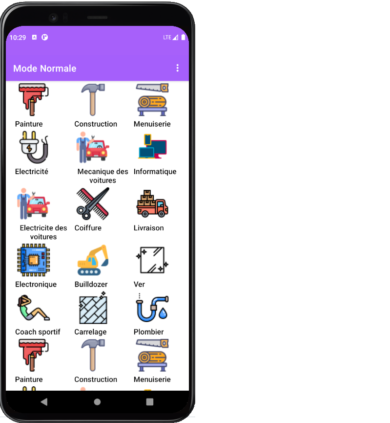

# Allom3alem

a mobile application to searching for a worker

## Getting Started

- Clone this repository: `git clone https://github.com/Benziza/allom3alem.git`.
- Import file **allom3alem.sql** in your database .
- Run the project from eclipse or intellij.

## Screenshot

## Technologie

**mobile operating system:** Android

**Database:** Sqlite

## Version

| Technologie Name | Version |
| :--------------- | :-----: |
| Android          |   12    |
| Sqlite           | 3.35. 0 |
